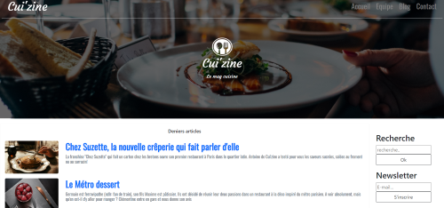
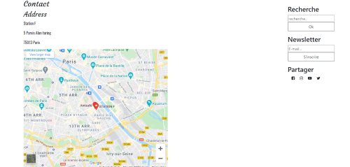
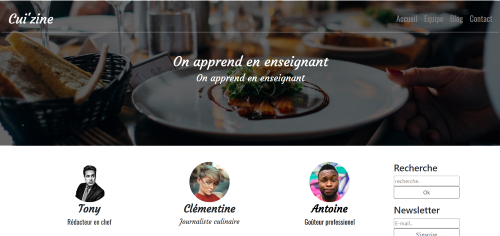
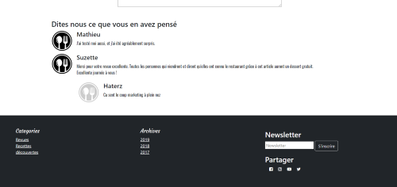

# My Cuizine

Project Binome d'ecole 'KONEXIO'

Reproduire à l'identique un site de cuisine responsive selon un modèle, en utilisant les classes Bootstrap et en évitant un maximum l'utilisation de CSS.

Technologies utilisées :  Vscode Html Css Bootstrap GitHub

Home page: 

Page Contact: Avec un Api google Map 

page d'equipe : 

Footer : Petite vue du footer page avec un petit commentaire.

                        
